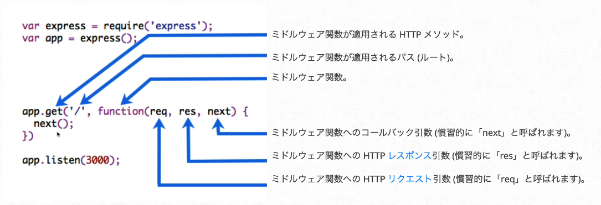

# Yell-Camp作成時のメモ

## Expressのミドルウェア

* ミドルウェアは、リクエスト/レスポンスのライフサイクルの中で実行されるただの関数のこと
* 各ミドルウェアは、リクエストオブジェクトとレスポンスオブジェクトにアクセスできる
* ミドルウェアは、res.send()などのメソッドでレスポンスを返してHTTPリクエストを終了させることができる
* ミドルウェアは、next()を呼び出すことで、次々と連鎖させることができる

https://expressjs.com/ja/guide/using-middleware.html


### morgan - ログ用ミドルウェア

https://www.npmjs.com/package/morgan


### nextの使い方

以下のように
expressでapp.get関数などでは第三引数まで設定することができて、
第三引数にnextの関数を設定することができる



use関数は他の関数実行時に必ず実行される関数だが、
以下のようにnextを書けば、次の処理が実行されるようになる

```javascript
app.use((req, res, next) => {
    console.log('初めてのミドルウェア');
    next();
})
```